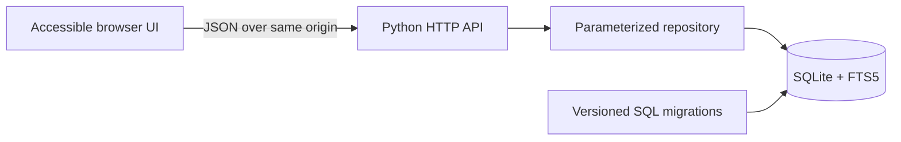

# ChessLife Discovery Demo

A polished, public reconstruction of a small publication-discovery workflow inspired by web work associated with ChessLife.

This repository is a portfolio demo, not the production ChessLife codebase. It contains no production source, private publication data, credentials, analytics, or US Chess infrastructure. Every article in the seed database is fictional demo content retained from the repository's original sample.

## What is included

- A dependency-free Python HTTP API built on the standard library
- SQLite migrations, foreign keys, indexes, and FTS5 full-text search
- Search by topic with category and publication-date filters
- Paginated publication results and article detail views
- Transparent related-reading recommendations based on category and token overlap
- A responsive, keyboard-friendly static interface with safe DOM rendering
- Security headers, parameterized SQL, API input bounds, and same-origin deployment
- Unit, integration, repository, migration, and frontend safety tests
- Docker, Compose, Make targets, and GitHub Actions CI

## Quick start

Python 3.11 or newer is recommended. The application has no third-party Python dependencies.

```bash
python -m chesslife_demo init-db
python -m chesslife_demo serve
```

Open [http://127.0.0.1:8000](http://127.0.0.1:8000).

The CLI defaults to `~/.chesslife-demo/chesslife.sqlite3`, which also works when the package is installed. The Make targets keep a development database in `instance/chesslife.sqlite3`. Override either convention with `--db` or `CHESSLIFE_DB_PATH`:

```bash
python -m chesslife_demo --db /tmp/chesslife.sqlite3 serve --port 8080
```

The application applies pending migrations automatically at startup. Migration `002_demo_seed.sql` inserts only the five fictional records already present in the original repository sample; their publication dates were not altered.

## Explore from the command line

The same FTS search used by the API is available as a small recommendation command:

```bash
python -m chesslife_demo recommend "endgame practice"
```

## Tests

```bash
python -m unittest discover -s tests -v
```

Or use the included shortcuts:

```bash
make test
make check
```

`make check` compiles the Python package and runs the complete test suite.

## Docker

```bash
docker compose up --build
```

The site will be available at [http://127.0.0.1:8000](http://127.0.0.1:8000), with the SQLite database stored in a named volume.

To run the image directly:

```bash
docker build -t chesslife-demo .
docker run --rm -p 8000:8000 -v chesslife-data:/data chesslife-demo
```

## API at a glance

| Method | Route | Purpose |
| --- | --- | --- |
| `GET` | `/api/health` | Liveness check |
| `GET` | `/api/categories` | Categories and publication counts |
| `GET` | `/api/publications` | FTS search, filters, and pagination |
| `GET` | `/api/publications/{id}` | Complete publication detail |
| `GET` | `/api/publications/{id}/recommendations` | Related reading |
| `GET` | `/api/recommendations?q=...` | Query-based recommendations |

See [docs/API.md](docs/API.md) for parameters and examples.

## Architecture



The code deliberately stays small and inspectable:

```text
chesslife_demo/       application, migrations, and packaged static frontend
tests/                database, repository, API, and frontend contract tests
docs/                 API, architecture, and development notes
frontend/             byte-for-byte original browser prototype (historical)
backend/              byte-for-byte original standalone SQL (historical)
ai_recommender/       byte-for-byte original TF prototype (historical)
legacy/               runnable, explicitly labeled copies of useful baselines
```

More detail is available in [docs/ARCHITECTURE.md](docs/ARCHITECTURE.md).

## Data and recommendation limitations

- The collection has five fictional articles, so search quality and recommendation quality cannot be generalized to a real archive.
- Recommendations are deterministic and explainable: token overlap plus a same-category bonus. They are not machine-learning predictions.
- Article bodies are intentionally short sample text, not copies of published ChessLife material.
- FTS5 must be enabled in the Python SQLite build. Standard CPython distributions include it; startup fails clearly if a migration cannot create the index.

## Historical baseline

The repository's original files remain byte-for-byte at their existing paths under `frontend/`, `backend/`, and `ai_recommender/`, so old links and the development record remain intact. They are historical artifacts and are not imported or served by the supported application. In particular, their SQL-style comments inside `.json` files remain intentionally untouched.

[`legacy/`](legacy/) contains runnable, explicitly labeled copies of the useful term-frequency and SQL baselines. Only the invalid leading JSON comment was removed from that copy. See [docs/HISTORY.md](docs/HISTORY.md) for the exact boundary between the supported application and preserved artifacts.

## Project status

This demo is complete for local portfolio use: the data layer, API, frontend, tests, and container path are connected. Before publishing under an open-source license, the repository owner should choose and add the desired license explicitly.
